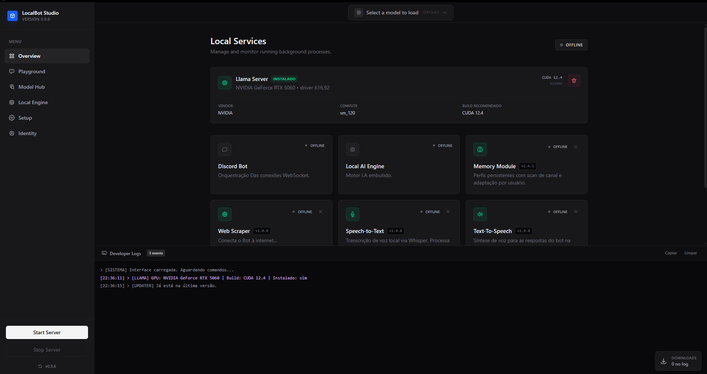
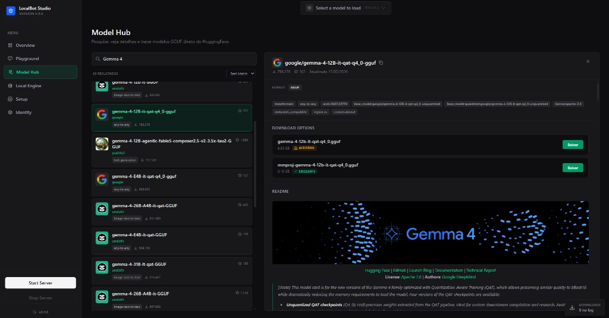
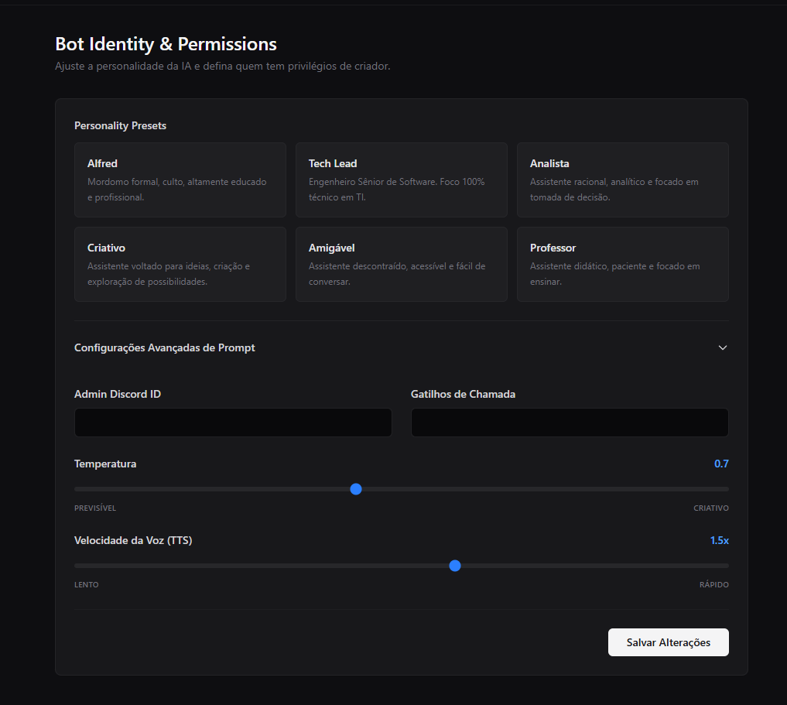
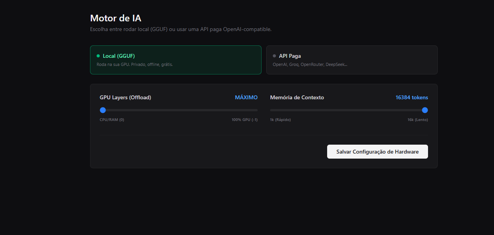

<div align="center">

# LocalBot Studio

**Crie bots de Discord com IA local ou em nuvem — direto do seu desktop.**

[](https://github.com/gmauad/localbot-studio/releases)
[](LICENSE)
[](https://github.com/gmauad/localbot-studio/releases)
[](https://electronjs.org)
[](https://react.dev)
[](https://github.com/gmauad/localbot-studio/releases)

[Baixar Última Versão](https://github.com/gmauad/localbot-studio/releases/latest) · [Reportar Bug](https://github.com/gmauad/localbot-studio/issues) · [Sugerir Feature](https://github.com/gmauad/localbot-studio/issues)

</div>

---

## Visão Geral

**LocalBot Studio** é uma aplicação desktop completa pra criar, configurar e rodar bots de Discord com inteligência artificial. Roda **100% local** — privado, offline e sem custos — utilizando modelos GGUF na sua GPU via `llama-server`. Alternativamente, conecta em qualquer API compatível com OpenAI (OpenAI, OpenRouter, Groq, DeepSeek, Mistral, Together AI, etc).

Tudo isso através de uma interface moderna, **sem precisar mexer em terminal, configurar Python ou escrever uma linha de código**.

---

## Screenshots

| Overview | Model Hub (HuggingFace) |
|:---:|:---:|
|  |  |
| **Identidade & Personalidade** | **Configuração do Motor de IA** |
|  |  |

---

## Features

### Motor de IA Flexível
- **Modo Local (GGUF)** — Roda modelos direto na sua GPU via `llama-server` com offload CUDA customizável
- **Modo API em Nuvem** — Suporte a OpenAI, OpenRouter, Groq, DeepSeek, Mistral, Together AI ou qualquer endpoint OpenAI-compatible
- **Troca em Runtime** — Alterna entre local e nuvem sem reiniciar o aplicativo

### Sistema de Persona
- **6 Presets Prontos** — Personalidades distintas (Alfred, Tech Lead, Analista, Criativo, Amigável, Professor)
- **Editor de Prompt** — System prompt totalmente customizável + temperatura ajustável

### Model Hub Integrado
- **Integração HuggingFace** — Busca e navega em milhares de modelos GGUF direto no app
- **Estimador de Hardware** — Avalia se o modelo roda bem na sua GPU antes de baixar
- **Downloader Interno** — Barra de progresso, velocidade em MB/s e cancelamento

### Capacidades de Voz (STT + TTS)
- **Speech-to-Text** — Transcrição de áudio local com Whisper
- **Text-to-Speech** — Síntese de voz pras respostas do bot com velocidade ajustável

### Ecossistema de Extensões
- **Plugins Modulares** — Adiciona capacidades (Web Scraper, etc) sem recompilar
- **Toggle pela UI** — Ativa/desativa extensões direto do dashboard

### Ferramentas de Desenvolvimento
- **Playground** — Testa contexto e respostas da IA em tempo real antes de ir pro Discord
- **Console Integrado** — Developer logs com cores por tipo de evento
- **Métricas de Geração** — Tokens/s, tempo de prompt, tamanho de contexto

###  Auto-Updater
- **Atualizações Automáticas** — Checa releases no GitHub no boot
- **Download em Background** — Baixa silenciosamente e instala ao fechar

---

##  Como Usar

### 1. Instalação 

Baixa a última versão na página de [**Releases**](https://github.com/gmauad/localbot-studio/releases/latest):

- `LocalBot-Studio-Setup.exe` — Instalador padrão (recomendado)

### 2. Configurar Credenciais do Discord

1. Abre o app → aba **Setup**
2. Clica em **Abrir Portal do Discord**
3. Cria uma nova *Application* → **Bot** → **Reset Token** → copia o token
4. Copia o **Application ID** (em *General Information*)
5. No app do Discord: **Configurações → Avançado → Modo Desenvolvedor ON**
6. Botão direito no seu nome → **Copiar ID**
7. Volta no app, cola tudo nos campos e clica em **Salvar Credenciais**

### 3. Escolher o Motor de IA

**Opção A — Local (GGUF)**
1. Aba **Local Engine** → instala o `llama-server` (baixa automaticamente)
2. Aba **Model Hub** → busca um modelo GGUF (ex: `Llama-3.2-3B-Instruct-GGUF`)
3. Baixa e carrega na VRAM
4. Ajusta GPU Layers e Contexto conforme a telemetria ao vivo

**Opção B — API em Nuvem**
1. Aba **Local Engine** → clica em **API Paga**
2. Escolhe o provedor, cola a API key e clica em **Testar**
3. Escolhe o modelo na lista e clica em **Salvar e Reiniciar IA**

### 4. Personalizar a Persona

Aba **Identity**:
- Escolhe um preset ou escreve seu próprio prompt
- Ajusta a temperatura (previsível ↔ criativo)
- Define os gatilhos de chamada do bot

### 5. Iniciar o Bot

Clica em **▶ Start Server** no canto inferior esquerdo. O bot inicializa os serviços e conecta no Discord automaticamente. 

---

##  Arquitetura

```text
┌─────────────────────────────────────────────────────────────┐
│                     LocalBot Studio (Electron)              │
│  ┌───────────────────────────────────────────────────────┐  │
│  │  React UI (Vite + Tailwind)                           │  │
│  └──────────────────────┬────────────────────────────────┘  │
│                         │ IPC                               │
│  ┌──────────────────────▼────────────────────────────────┐  │
│  │  Electron Main Process                                │  │
│  │  ├─ Orquestrador de Motores                           │  │
│  │  ├─ Detecção de Hardware                              │  │
│  │  ├─ Gerenciador de Downloads                          │  │
│  │  ├─ Auto-updater (electron-updater)                   │  │
│  │  └─ Portal do Discord (BrowserWindow)                 │  │
│  └──────────────────────┬────────────────────────────────┘  │
│                         │ spawn                             │
│  ┌──────────────────────▼────────────────────────────────┐  │
│  │  Backend (Node.js + Python )                          │  │
│  │  ├─ bot.js           → Cliente Discord                │  │
│  │  ├─ ia_server.py     → llama.cpp proxy / API Nuvem    │  │
│  │  ├─ voz_api.py       → Whisper STT                    │  │
│  │  ├─ falar_api.py     → Edge TTS                       │  │
│  │  ├─ scrapper_api.js  → Web Scraper                    │  │
│  │  └─ extensions/      → Plugins Modulares              │  │
│  └───────────────────────────────────────────────────────┘  │
└─────────────────────────────────────────────────────────────┘
```

---

##  Desenvolvimento

### Pré-requisitos

- **Node.js** 20+
- **Python** 3.11 (embedado nos builds de produção)
- **Git**
- **GPU NVIDIA** *(opcional — recomendado pro modo local)*

### Setup

```bash
# Clona o repositório
git clone https://github.com/gmauad/localbot-studio.git
cd localbot-studio

# Instala dependências
npm install

# Roda em modo dev
npm run dev
```

### Scripts Disponíveis

| Comando | Descrição |
|---|---|
| `npm run dev` | Inicia Vite + Electron com hot-reload |
| `npm run build` | Compila o frontend React pra produção |
| `npm run build:win` | Gera o instalador `.exe` |

---

##  Stack

<table>
<tr>
<td valign="top" width="50%">

**Frontend**
-  React 19
-  Vite 8
-  TailwindCSS 4
-  react-markdown + GFM

</td>
<td valign="top" width="50%">

**Backend / Desktop**
-  Electron 44
-  Node.js + Discord.js 14
-  Python 3.11 (embedado)
-  better-sqlite3

</td>
</tr>
<tr>
<td valign="top" width="50%">

**IA Local**
-  llama.cpp (GGUF)
-  Whisper (STT)
-  Edge TTS
-  CUDA 12.4

</td>
<td valign="top" width="50%">

**IA em Nuvem**
-  OpenAI
-  OpenRouter
-  Groq
-  DeepSeek
-  Mistral
-  Together AI

</td>
</tr>
</table>

---

## Contribuindo

Contribuições são muito bem-vindas!

1. Faz um **fork** do projeto
2. Cria uma branch: `git checkout -b feature/MinhaFeature`
3. Commit seguindo [Conventional Commits](https://www.conventionalcommits.org/):
   - `feat:` — Nova funcionalidade
   - `fix:` — Correção de bug
   - `docs:` — Documentação
   - `refactor:` — Refatoração
   - `chore:` — Manutenção
4. Push: `git push origin feature/MinhaFeature`
5. Abre um **Pull Request**

---

## Licença

Distribuído sob a licença **MIT**. Veja [`LICENSE`](LICENSE) para mais informações.

---

## Créditos

- [**llama.cpp**](https://github.com/ggerganov/llama.cpp) — Motor de inferência GGUF
- [**Discord.js**](https://discord.js.org) — Biblioteca do Discord
- [**HuggingFace**](https://huggingface.co) — Hub de modelos
- [**Electron**](https://electronjs.org) + [**React**](https://react.dev) — Base do app

---

<div align="center">

**Feito por [GMauad](https://github.com/gmauad)**

[⬆ Voltar ao topo](#-localbot-studio)

</div>